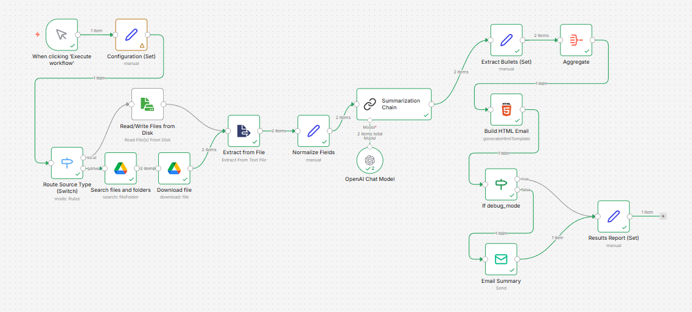
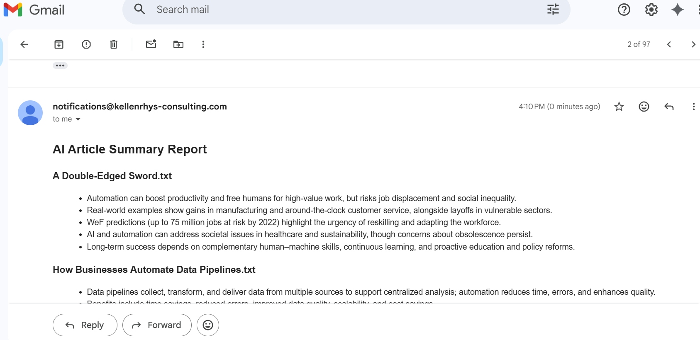

# n8n AI Document Summarizer

This project demonstrates an **AI-powered document summarization workflow built with n8n**.

The workflow downloads an arbitrary number of `.txt` articles from either **Google Drive** or the **local filesystem**, summarizes each document using a LLM, and sends a **HTML email report** containing bullet-point insights.

It's a **portable automation demo** demonstrating how AI can be integrated into your workflows.

---

## Workflow Overview

```
Manual Trigger
   ↓
Configuration
   ↓
Import Files (Google Drive or Local)
   ↓
Summarization (LLM with chunking)
   ↓
Build HTML Report
   ↓
Send Email (disabled in debug mode)
   ↓
Execution Report
```

Generates **up to five bullet points** for each article.

---

## Repository Contents

```
AI Document Summarizer.json    n8n workflow export
README.md                      documentation
example-input/                 sample documents
screenshots/                   workflow and report screenshots
```

Example repository structure:

```
n8n-ai-document-summarizer
│
├─ 'AI Document Summarizer.json'
├─ README.md
│
├─ example-input
│   ├─ 'How Businesses Automate Data Pipelines.txt'
│   └─ 'Streamlining Document Summarization with AI.txt'
│
└─ screenshots
    ├─ workflow-overview.png
    └─ results-email.png
```

---

## Setup

### 1. Import Workflow

Download `'AI Document Summarizer.json'` and import it into your **n8n** instance.

---

### 2. Configure Credentials

Create credentials in n8n for:

* **OpenAI**
* **Resend**
* **Google Drive** *(optional)*

Credentials are **not included** in this repository.

---

### 3. Configure the Workflow

Open the **Configuration** node and update the following settings.

#### Debug Mode

```
true  → emails disabled (safe testing)
false → email delivery enabled
```

#### Email Settings

```
from_email
to_email
```

#### Source Type

```
local
gdrive
```

#### Source Paths

**Local Source Path:**

Local files default to:

```
/home/node/.n8n-files/incoming/*.txt
```

If running n8n in Docker, make sure the directory is mounted:

```
/home/node/.n8n-files
```

Alternatively configure:

```
N8N_FILESYSTEM_ALLOW_PATH
```

<br>

**Google Drive Source Path:**

To summarize files from Google Drive:

1. Navigate to the folder in Drive
2. Copy the folder ID from the URL

Example:

```
https://drive.google.com/drive/folders/<folder_id>
```

Replace the example ID in the configuration node.

---

### 4. Run the Workflow

Trigger the workflow manually.

---

### 5. Review Results

Open the **Results Report** node to see:

* files processed
* summaries generated
* emails sent
* execution timestamp

---

## Potential Enhancements

Possible extensions include:

* Support additional document formats (PDF, DOCX, Google Docs)
* Add scheduled or event-based triggers for continuous ingestion
* Generate a final **combined summary of all documents**
* Integrate additional sources (Dropbox, SharePoint, S3)
* Swap the LLM provider (OpenAI, local models via Ollama, etc.)

---

## Workflow Overview



## Example Results




## Purpose
This repository is intended as a **demonstration of automation architecture and AI-powered document processing using n8n**.

It is intended as a portfolio example for automation and backend integration work.

## Notes
Credentials and API keys must be configured locally after importing the workflow.
